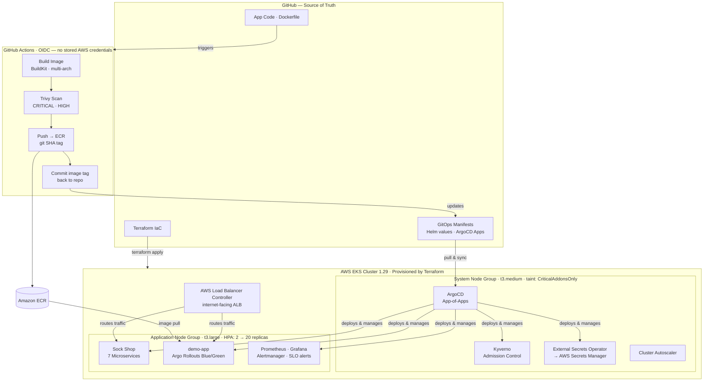
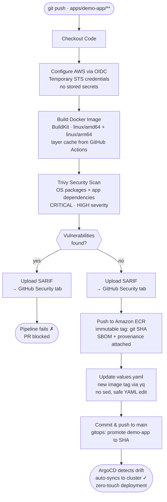

# AWS EKS GitOps Platform — Production-Grade Kubernetes on AWS

> **A fully automated, production-grade Kubernetes platform on AWS EKS** built with Terraform, ArgoCD, and GitHub Actions — demonstrating DevSecOps, GitOps, observability, and advanced deployment patterns.

[](https://www.terraform.io/)
[](https://kubernetes.io/)
[](https://argoproj.github.io/cd/)
[](LICENSE)

---

## Architecture Overview



### Key Design Decisions

| Decision | Rationale |
|----------|-----------|
| **IRSA over node-level IAM** | Pod-scoped AWS permissions — least privilege per workload |
| **OIDC for GitHub Actions** | No long-lived AWS credentials stored in GitHub Secrets |
| **App-of-Apps ArgoCD pattern** | Single root app bootstraps entire platform declaratively |
| **Managed Node Groups** | AWS-managed node lifecycle, automatic AMI updates |
| **Multi-AZ NAT Gateways** | HA for production; single NAT option for cost in dev |
| **Kyverno over OPA Gatekeeper** | Native Kubernetes policy engine, simpler DSL, audit mode |
| **External Secrets Operator** | Centralized secret management via AWS Secrets Manager |
| **Argo Rollouts Blue/Green** | Zero-downtime deployments with instant rollback capability |

---

## Repository Structure

```
.
├── .github/
│   └── workflows/
│       ├── ci-cd.yml            # Build → Scan → Push → Deploy pipeline
│       └── terraform.yml        # Terraform plan/apply with PR comments
│
├── infrastructure/
│   └── terraform/
│       ├── modules/
│       │   ├── vpc/             # VPC, subnets, NAT, route tables
│       │   ├── eks/             # EKS cluster, node groups, addons
│       │   └── irsa/            # IAM Roles for Service Accounts
│       ├── main.tf              # Module orchestration
│       ├── helm.tf              # ArgoCD + ALB Controller via Helm
│       ├── variables.tf
│       ├── outputs.tf
│       ├── versions.tf          # Provider version constraints
│       └── backend.tf           # S3 remote state + DynamoDB lock
│
├── apps/
│   ├── argocd/
│   │   ├── app-of-apps.yaml     # Root ArgoCD Application (bootstraps all)
│   │   └── applications/        # Individual ArgoCD Application manifests
│   │       ├── sock-shop.yaml
│   │       ├── monitoring.yaml
│   │       ├── security.yaml
│   │       ├── external-secrets.yaml
│   │       └── argo-rollouts.yaml
│   ├── demo-app/                # Sample app: Dockerfile + Helm chart + Rollout
│   ├── monitoring/              # kube-prometheus-stack values + alert rules
│   └── security/
│       ├── kyverno/policies/    # Admission control policies
│       ├── network-policies/    # Zero-trust network segmentation
│       └── external-secrets/    # ESO SecretStore + ExternalSecret CRDs
│
└── docs/
    ├── architecture.md          # Detailed architecture decisions
    └── runbook.md               # Day-2 operations guide
```

---

## Prerequisites

| Tool | Version | Purpose |
|------|---------|---------|
| Terraform | >= 1.6 | Infrastructure provisioning |
| AWS CLI | >= 2.x | AWS authentication |
| kubectl | >= 1.29 | Cluster management |
| Helm | >= 3.12 | Chart deployments |
| ArgoCD CLI | >= 2.9 | GitOps management |

---

## Quick Start

### 1. Bootstrap AWS Infrastructure

```bash
# Clone and configure
git clone https://github.com/immanuwell/aws-eks-gitops-terraform-argocd
cd aws-eks-gitops-terraform-argocd

# Create S3 bucket and DynamoDB table for Terraform state
make bootstrap-state REGION=us-east-1

# Copy and edit variables
cp infrastructure/terraform/terraform.tfvars.example infrastructure/terraform/terraform.tfvars
# Edit terraform.tfvars with your values

# Initialize and apply
cd infrastructure/terraform
terraform init
terraform plan -out=tfplan
terraform apply tfplan
```

### 2. Configure kubectl

```bash
aws eks update-kubeconfig \
  --region us-east-1 \
  --name $(terraform output -raw cluster_name)
```

### 3. Bootstrap ArgoCD App-of-Apps

```bash
# Get ArgoCD initial password
kubectl -n argocd get secret argocd-initial-admin-secret \
  -o jsonpath="{.data.password}" | base64 -d

# Apply root App-of-Apps
kubectl apply -f apps/argocd/app-of-apps.yaml

# ArgoCD will now sync all applications automatically
```

### 4. Access Services

```bash
# ArgoCD UI
kubectl port-forward svc/argocd-server -n argocd 8080:443
# → https://localhost:8080

# Grafana UI
kubectl port-forward svc/kube-prometheus-stack-grafana -n monitoring 3000:80
# → http://localhost:3000 (admin / get password from secret)

# Sock Shop
kubectl get ingress -n sock-shop
```

---

## CI/CD Pipeline

The pipeline uses **GitHub OIDC** for keyless AWS authentication — no static credentials stored in GitHub.



---

## DevSecOps: Security Controls

### Admission Control (Kyverno)

| Policy | Mode | Description |
|--------|------|-------------|
| `require-labels` | Enforce | All workloads must have `app` and `env` labels |
| `disallow-privileged` | Enforce | Block privileged containers and host namespaces |
| `require-resource-limits` | Enforce | CPU/memory limits mandatory on all containers |
| `disallow-latest-tag` | Enforce | Container images must be pinned to a specific tag |
| `require-pod-disruption-budget` | Audit | PDBs recommended for production workloads |

### Network Segmentation

Zero-trust network model with explicit allow rules:
- **Default deny** all ingress/egress per namespace
- Monitoring namespace → scrape pods across namespaces
- Sock-shop services → explicit inter-service communication rules
- External ingress → only via ALB Ingress Controller

### Secret Management (External Secrets Operator)

```
AWS Secrets Manager / SSM Parameter Store
          │
          ▼
  ExternalSecret CRD (in Git — no secret values!)
          │
          ▼
  ESO Controller (via IRSA)
          │
          ▼
  Kubernetes Secret (auto-rotated)
          │
          ▼
  Pod environment variable / mounted volume
```

---

## Observability Stack

**kube-prometheus-stack** (Prometheus + Grafana + Alertmanager):

- **Metrics**: Cluster, node, pod, and application-level metrics
- **Dashboards**: Pre-built + custom Grafana dashboards (Kubernetes cluster, Sock-Shop SLOs)
- **Alerts**: Node not ready, pod crash-looping, high memory/CPU, HPA at max scale
- **HPA**: Horizontal Pod Autoscaler on Sock-Shop front-end (CPU 60% target, 2–20 replicas)

---

## Blue-Green Deployment (Argo Rollouts)

The `demo-app` uses Argo Rollouts for zero-downtime blue-green deployments:

```bash
# Trigger a new rollout
kubectl argo rollouts set image demo-app \
  demo-app=YOUR_ECR/demo-app:NEW_TAG -n demo-app

# Watch rollout progress
kubectl argo rollouts get rollout demo-app -n demo-app --watch

# Promote (switch traffic from blue to green)
kubectl argo rollouts promote demo-app -n demo-app

# Rollback if issues detected
kubectl argo rollouts abort demo-app -n demo-app
```

---

## Infrastructure Costs (Estimated)

| Resource | Spec | Monthly Cost (approx) |
|----------|------|-----------------------|
| EKS Control Plane | Managed | ~$73 |
| Node Group: system | 2x t3.medium | ~$60 |
| Node Group: app | 3x t3.large | ~$120 |
| NAT Gateways | 3x (multi-AZ) | ~$100 |
| ALB | 1x Application LB | ~$20 |
| ECR | Storage + transfer | ~$5 |
| **Total** | | **~$378/month** |

> For cost savings during development, use `single_nat_gateway = true` in terraform.tfvars.

---

## Technologies Used

| Category | Technology |
|----------|-----------|
| Cloud | AWS (EKS, ECR, VPC, IAM, Secrets Manager, SSM) |
| IaC | Terraform 1.6+, terraform-aws-modules |
| Containers | Docker, AWS ECR |
| Orchestration | Kubernetes 1.29, Helm 3 |
| GitOps | ArgoCD 2.9 (App-of-Apps), Argo Rollouts |
| CI/CD | GitHub Actions (OIDC auth) |
| Security Scanning | Trivy (image + IaC) |
| Policy Enforcement | Kyverno |
| Network Security | Kubernetes NetworkPolicy |
| Secret Management | External Secrets Operator + AWS Secrets Manager |
| Observability | Prometheus, Grafana, Alertmanager |
| Autoscaling | HPA (CPU/memory), Cluster Autoscaler |
| Ingress | AWS Load Balancer Controller |
| DNS | ExternalDNS (optional) |

---

## Author

Built as a production-grade DevOps portfolio project demonstrating:
- Cloud-native infrastructure design (AWS EKS)
- GitOps methodology at scale (ArgoCD App-of-Apps)
- DevSecOps pipeline with shift-left security (Trivy, Kyverno)
- Zero-downtime deployment strategies (Argo Rollouts)
- Day-2 operations readiness (observability, runbooks, HPA)
